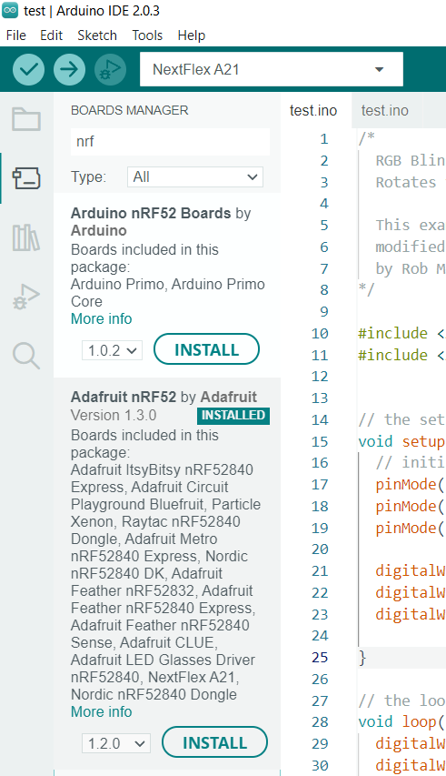
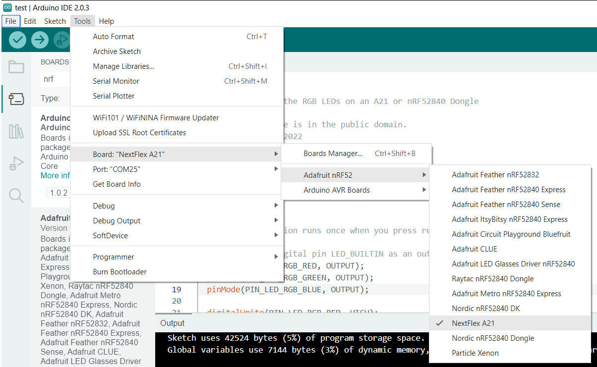

# Dependencies:
Downlod Arduino IDE 2.0, here:
https://downloads.arduino.cc/arduino-ide/arduino-ide_2.0.3_Windows_64bit.exe

# Setup Instructions

## Install Arduino IDE

## Setup Additional Boards for nRF
You'll need to setup the Arduino preferences for "Additional boards manager URL" and add the URL for the JSON related to the Adafruit boards, specifically:
https://adafruit.github.io/arduino-board-index/package_adafruit_index.json

## Install Board Support Package Toolchain
After providing the adafruit package index JSON, a search for "NRF" within the Boards Manager will list the Adafruit nRf52 BSP.  You'll want to install it as shown in the following image.


## Add NextFlex custom variant files
The custom board configurations NextFlex boards require are only available within GitLab.  You'll need to copy the contents of the ```Arduino packages``` into the Adafruit package install location, which should be found under the path:<br>
``` %APPDATA%\..\Local\Arduino15\packages\adafruit\hardware\nrf52\1.3.0\ ``` 

## Build and upload to A21
First ensure the A21 is running the bootloader and is in the programmable state.  You'll see NRFBOOT as a drive, and also a virtualized COM port.

Next, within the Arduino IDE, select *Tools->Board->Adafruit nRF52->NextFlex A21*


You should also see a Port option and will need to select the COM port the A21 is set to.

Use the following demo program to cycle between the RGB LED colors:
```
/*
  RGB Blink
  Rotates through the RGB LEDs on an A21 or nRF52840 Dongle
  
  This example code is in the public domain.
  modified 21 Dec 2022
  by Rob McManus
*/

#include <Arduino.h>
#include <Adafruit_TinyUSB.h> // for Serial


// the setup function runs once when you press reset or power the board
void setup() {
  // initialize digital pin LED_BUILTIN as an output.
  pinMode(PIN_LED_RGB_RED, OUTPUT);
  pinMode(PIN_LED_RGB_GREEN, OUTPUT);
  pinMode(PIN_LED_RGB_BLUE, OUTPUT);

  digitalWrite(PIN_LED_RGB_RED, HIGH);
  digitalWrite(PIN_LED_RGB_GREEN, HIGH);
  digitalWrite(PIN_LED_RGB_BLUE, HIGH);
  
}
     
// the loop function runs over and over again forever
void loop() {
  digitalWrite(PIN_LED_RGB_RED, LOW);
  digitalWrite(PIN_LED_RGB_GREEN, HIGH);
  digitalWrite(PIN_LED_RGB_BLUE, HIGH);  
  delay(1000);                // wait for a second
  digitalWrite(PIN_LED_RGB_RED, HIGH);
  digitalWrite(PIN_LED_RGB_GREEN, LOW);
  digitalWrite(PIN_LED_RGB_BLUE, HIGH);  
  delay(1000);                // wait for a second
  digitalWrite(PIN_LED_RGB_RED, HIGH);
  digitalWrite(PIN_LED_RGB_GREEN, HIGH);
  digitalWrite(PIN_LED_RGB_BLUE, LOW);  
  delay(1000);                // wait for a second

}
```

Compile using the option *Sketch->Verify/Compile*.

Now upload using *Sketch->Upload*.  You should see a successful compile and upload message, and the RGB LED should cycle.


