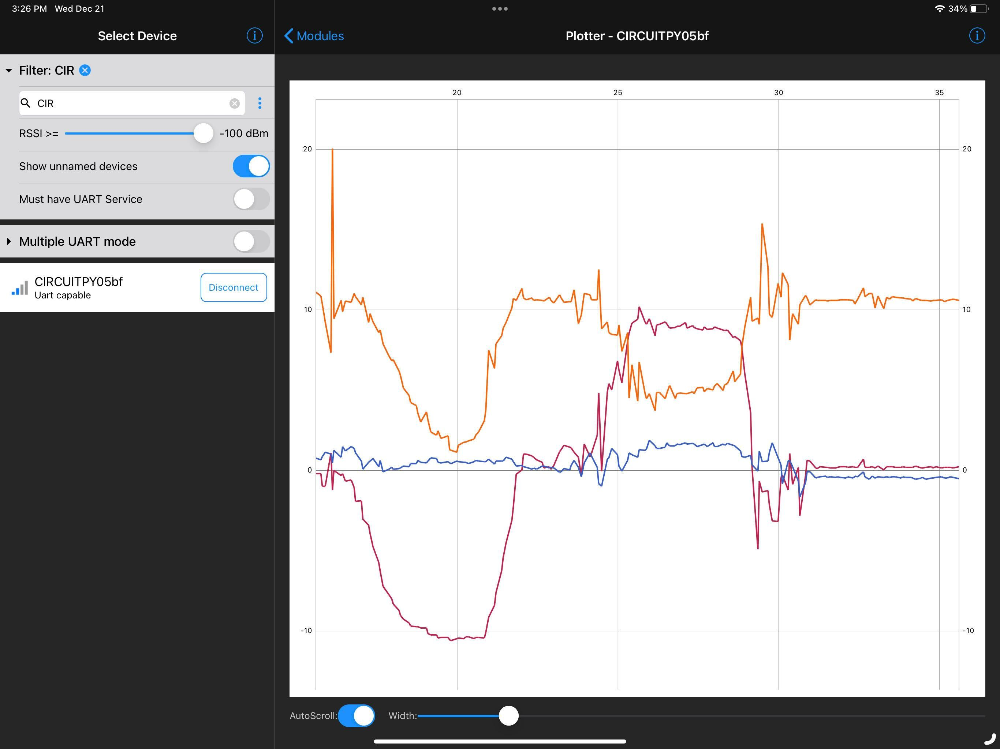

# Overview
This demo will show you how to read the accelerometer data on the A21 via I2C and push it via the BLE UART service.  The iOS/Android app, BlueFruit, can be used to quickly plot the BLE UART output.

